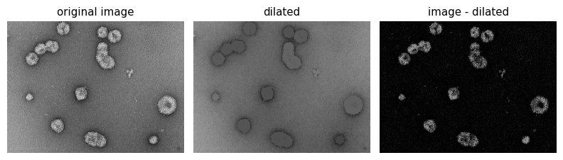
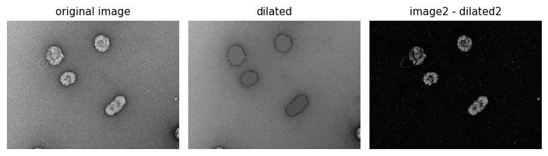
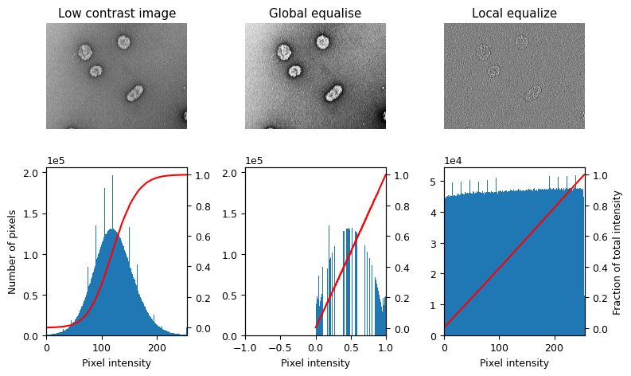
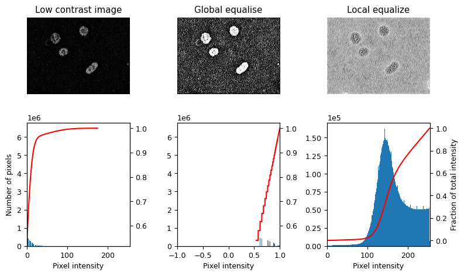
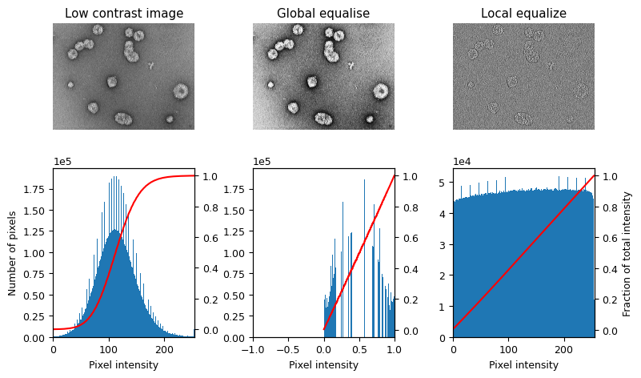
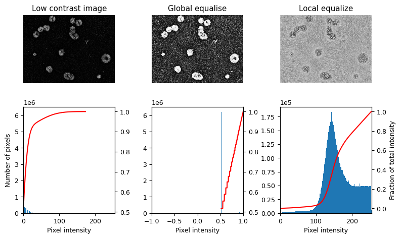

### Detecting Vesicles: Part I ###

Author: Virly Y. Ananda <br>
Affiliation: Department of Molecular Biology, Massachusetts General Hospital<br>

Implementing object detection on 2D TEM images can be challenging due to complex features of the region of interests (ROIs). This is because most of the TEM images we collected produced uneven shades on the background, and foreground features vary based on sample preparation. This documentation provides a walkthough on how we can segment out our targeted vesicles while minimizing false positives upon implementing automatic segmentation. <br>

--------

#### Imaging Software Requirements ####
- FIJI (FIJI is just ImageJ) [1] <br>
- Ilastik [2] <br>
- Jupyter Notebook

#### Pre-Processing: Qualityu  ####

Understanding the pixel intesities of raw TEM images must be done to subtract the uneven background shades. To do this, we performed 1-2 images intensity analysis followed by batch convertsion of the background subtraction technique to the rest of the images. <br>

Note: It is important to process the data in a format where image quality can be preserved.

```python
# Import necessary packages: It is best if you have the packages installed in a conda environment.
import numpy as np
import matplotlib.pyplot as plt

from scipy.ndimage import gaussian_filter
from skimage import data
from skimage import img_as_float
from skimage.morphology import reconstruction
from skimage.color import rgb2gray
```

#### Test on Local Data ####


```python
# Convert to float: Important for subtraction later which won't work with uint8
from skimage import io

# Load the image from local directory:
image1 = img_as_float(io.imread('/home/ananda/Downloads/vesicle2.png'))
image1_gaus = gaussian_filter(image1, 1)

seed = np.copy(image1)
seed[1:-1, 1:-1] = image.min()
mask1 = image1

dilated1 = reconstruction(seed, mask1, method='Dilated')
```


```python
# Subtracting the dilated image leaves an image with just the ROIs and a flat, black background, as shown below.
fig, (ax0, ax1, ax2) = plt.subplots(nrows=1,
                                    ncols=3,
                                    figsize=(8, 2.5),
                                    sharex=True,
                                    sharey=True)

ax0.imshow(image1, cmap='gray')
ax0.set_title('Raw Image')
ax0.axis('off')

ax1.imshow(dilated1, vmin=image1.min(), vmax=image1.max(), cmap='gray')
ax1.set_title('Dilated')
ax1.axis('off')

final_image1 = image1 - dilated1

ax2.imshow(final_image1, cmap='gray')

ax2.set_title('image1 - dilated1')
ax2.axis('off')

fig.tight_layout()
```


    

    


```python
# Obtain the final image1
greyFinalImage1 = ax2.imshow(final_image1, cmap='gray')
greyImage1 = greyFinalImage1.get_array()
```


```python
# Obtain dilated image
dilatedImage1 = ax2.imshow(dilated1, vmin=image1.min(), vmax=image1.max(), cmap='gray')
dilImage1 = dilatedImage1.get_array()
```


```python
# Load 2nd image
image2 = img_as_float(io.imread('/home/ananda/Downloads/vesicles.png'))
```


```python
image2 = gaussian_filter(image2, 1)

seed = np.copy(image2)
seed[1:-1, 1:-1] = image2.min()
mask2 = image2

dilated2 = reconstruction(seed, mask2, method='Dilated')
```


```python
# Subtracting the dilated image leaves an image with just the coins and a flat, black background, as shown below.
fig, (ax0, ax1, ax2) = plt.subplots(nrows=1,
                                    ncols=3,
                                    figsize=(8, 2.5),
                                    sharex=True,
                                    sharey=True)

ax0.imshow(image2, cmap='gray')
ax0.set_title('Raw Image')
ax0.axis('off')

ax1.imshow(dilated2, vmin=image2.min(), vmax=image2.max(), cmap='gray')
ax1.set_title('Dilated')
ax1.axis('off')

final_image2 = image2 - dilated2

#ax2.imshow(image - dilated, cmap='gray')
ax2.imshow(final_image2, cmap='gray')
#ax2.imshow(final_image, cmap='gray')
ax2.set_title('image2 - dilated2')
ax2.axis('off')

fig.tight_layout()
```


    

    


```python
# Obtain the final image
greyFinalImage2 = ax2.imshow(final_image2, cmap='gray')
greyImage2 = greyFinalImage2.get_array()
```


```python
# Obtain the dilated image
dilImageplot2 = ax1.imshow(dilated2, vmin=image.min(), vmax=image.max(), cmap='gray')
dilImage2 = dilImageplot2.get_array()
```

### Evaluate Instensity Values


```python
# Import necessary modules/packages (If you already imported some of the modules previously, you don't have to import it again)
import numpy as np
import matplotlib
import matplotlib.pyplot as plt

from skimage import data
from skimage.util.dtype import dtype_range
from skimage.util import img_as_ubyte
from skimage import exposure
from skimage.morphology import disk
from skimage.morphology import ball
from skimage.filters import rank
```


```python
matplotlib.rcParams['font.size'] = 9

# Create a function where we could seethe pixel instinsities on our processed images:
def plot_img_and_hist(imagedata, axes, bins=256):
    """Plot an image along with its histogram and cumulative histogram.

    """
    ax_img, ax_hist = axes
    ax_cdf = ax_hist.twinx()

    # Display image
    ax_img.imshow(imagedata, cmap=plt.cm.gray)
    ax_img.set_axis_off()

    # Display histogram
    ax_hist.hist(imagedata.ravel(), bins=bins)
    ax_hist.ticklabel_format(axis='y', style='scientific', scilimits=(0, 0))
    ax_hist.set_xlabel('Pixel intensity')

    xmin, xmax = dtype_range[imagedata.dtype.type]
    ax_hist.set_xlim(xmin, xmax)

    # Display cumulative distribution
    img_cdf, bins = exposure.cumulative_distribution(imagedata, bins)
    ax_cdf.plot(bins, img_cdf, 'r')

    return ax_img, ax_hist, ax_cdf
```


```python
# Load an example image
img1 = img_as_ubyte(io.imread('/home/ananda/Downloads/vesicles.png'))

# Global equalize
img_rescale1 = exposure.equalize_hist(img1)

# Equalization
footprint = disk(30)
img_eq1 = rank.equalize(img1, footprint=footprint)
```


```python
# Display results
fig = plt.figure(figsize=(8, 5))
axes = np.zeros((2, 3), dtype=object)
axes[0, 0] = plt.subplot(2, 3, 1)
axes[0, 1] = plt.subplot(2, 3, 2, sharex=axes[0, 0], sharey=axes[0, 0])
axes[0, 2] = plt.subplot(2, 3, 3, sharex=axes[0, 0], sharey=axes[0, 0])
axes[1, 0] = plt.subplot(2, 3, 4)
axes[1, 1] = plt.subplot(2, 3, 5)
axes[1, 2] = plt.subplot(2, 3, 6)

ax_img, ax_hist, ax_cdf = plot_img_and_hist(img1, axes[:, 0])
ax_img.set_title('Low Contrast Image')
ax_hist.set_ylabel('Number of Pixels')

ax_img, ax_hist, ax_cdf = plot_img_and_hist(img_rescale1, axes[:, 1])
ax_img.set_title('Global equalise')

ax_img, ax_hist, ax_cdf = plot_img_and_hist(img_eq1, axes[:, 2])
ax_img.set_title('Local equalize')
ax_cdf.set_ylabel('Fraction of total intensity')

# prevent overlap of y-axis labels
fig.tight_layout()
```


    

    


```python
# Load an example image
img2 = img_as_ubyte(greyImage2)

# Global equalize
img_rescale2 = exposure.equalize_hist(img2)

# Equalization
footprint = disk(30)
img_eq2 = rank.equalize(img2, footprint=footprint)
```


```python
# Display results
fig = plt.figure(figsize=(8, 5))
axes = np.zeros((2, 3), dtype=object)
axes[0, 0] = plt.subplot(2, 3, 1)
axes[0, 1] = plt.subplot(2, 3, 2, sharex=axes[0, 0], sharey=axes[0, 0])
axes[0, 2] = plt.subplot(2, 3, 3, sharex=axes[0, 0], sharey=axes[0, 0])
axes[1, 0] = plt.subplot(2, 3, 4)
axes[1, 1] = plt.subplot(2, 3, 5)
axes[1, 2] = plt.subplot(2, 3, 6)

ax_img, ax_hist, ax_cdf = plot_img_and_hist(img2, axes[:, 0])
ax_img.set_title('Low Contrast Image')
ax_hist.set_ylabel('Number of pixels')

ax_img, ax_hist, ax_cdf = plot_img_and_hist(img_rescale2, axes[:, 1])
ax_img.set_title('Global equalise')

ax_img, ax_hist, ax_cdf = plot_img_and_hist(img_eq2, axes[:, 2])
ax_img.set_title('Local equalize')
ax_cdf.set_ylabel('Fraction of total intensity')

# prevent overlap of y-axis labels
fig.tight_layout()
```


    

    


```python
# Load our second image

img = img_as_ubyte(io.imread('/home/ananda/Downloads/vesicle2.png'))

# Global equalize
img_rescale = exposure.equalize_hist(img)

# Equalization
footprint = disk(30)
img_eq = rank.equalize(img, footprint=footprint)
```


```python
# Display results
fig = plt.figure(figsize=(8, 5))
axes = np.zeros((2, 3), dtype=object)
axes[0, 0] = plt.subplot(2, 3, 1)
axes[0, 1] = plt.subplot(2, 3, 2, sharex=axes[0, 0], sharey=axes[0, 0])
axes[0, 2] = plt.subplot(2, 3, 3, sharex=axes[0, 0], sharey=axes[0, 0])
axes[1, 0] = plt.subplot(2, 3, 4)
axes[1, 1] = plt.subplot(2, 3, 5)
axes[1, 2] = plt.subplot(2, 3, 6)

ax_img, ax_hist, ax_cdf = plot_img_and_hist(img, axes[:, 0])
ax_img.set_title('Low contrast image')
ax_hist.set_ylabel('Number of pixels')

ax_img, ax_hist, ax_cdf = plot_img_and_hist(img_rescale, axes[:, 1])
ax_img.set_title('Global equalise')

ax_img, ax_hist, ax_cdf = plot_img_and_hist(img_eq, axes[:, 2])
ax_img.set_title('Local equalize')
ax_cdf.set_ylabel('Fraction of total intensity')

# prevent overlap of y-axis labels
fig.tight_layout()
```


    

    


```python
# Load an example image

img = img_as_ubyte(greyImage)

# Global equalize
img_rescale = exposure.equalize_hist(img)

# Equalization
footprint = disk(30)
img_eq = rank.equalize(img, footprint=footprint)
```


```python
# Display results
fig = plt.figure(figsize=(8, 5))
axes = np.zeros((2, 3), dtype=object)
axes[0, 0] = plt.subplot(2, 3, 1)
axes[0, 1] = plt.subplot(2, 3, 2, sharex=axes[0, 0], sharey=axes[0, 0])
axes[0, 2] = plt.subplot(2, 3, 3, sharex=axes[0, 0], sharey=axes[0, 0])
axes[1, 0] = plt.subplot(2, 3, 4)
axes[1, 1] = plt.subplot(2, 3, 5)
axes[1, 2] = plt.subplot(2, 3, 6)

ax_img, ax_hist, ax_cdf = plot_img_and_hist(img, axes[:, 0])
ax_img.set_title('Low contrast image')
ax_hist.set_ylabel('Number of pixels')

ax_img, ax_hist, ax_cdf = plot_img_and_hist(img_rescale, axes[:, 1])
ax_img.set_title('Global equalise')

ax_img, ax_hist, ax_cdf = plot_img_and_hist(img_eq, axes[:, 2])
ax_img.set_title('Local equalize')
ax_cdf.set_ylabel('Fraction of total intensity')

# prevent overlap of y-axis labels
fig.tight_layout()
```


    

    


### Save Images for Segmentation


```python
# Save adjusted images to local directory
import numpy as np
from skimage.io import imsave, imread

vesicle1 = img_as_ubyte(dilImage1)
vesicle2 = img_as_ubyte(dilImage2)

imsave("vesicle_dil1.png", vesicle1)
imsave("vesicle_dil2.png", vesicle2)
```

