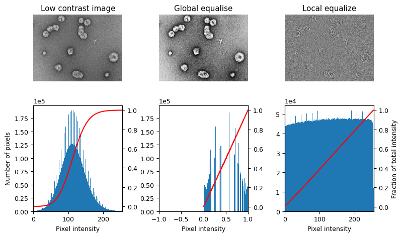
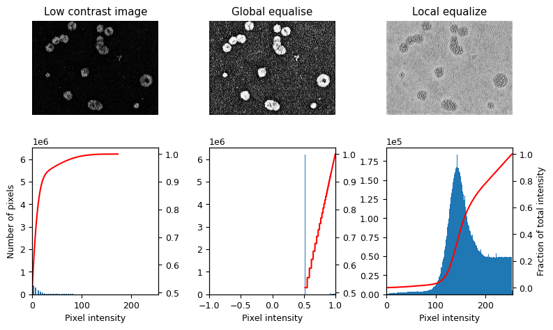

### Pre-Process Image ###


```python
# Import necessary packages
import numpy as np
import matplotlib.pyplot as plt

from scipy.ndimage import gaussian_filter
from skimage import data
from skimage import img_as_float
from skimage.morphology import reconstruction
from skimage.color import rgb2gray
```

#### Test on Local Data ####


```python
# Convert to float: Important for subtraction later which won't work with uint8
from skimage import io
image = img_as_float(io.imread('/home/ananda/Downloads/vesicle2.png'))
```


```python
#image = img_as_float(data.coins())
image = gaussian_filter(image, 1)

seed = np.copy(image)
seed[1:-1, 1:-1] = image.min()
mask = image

dilated = reconstruction(seed, mask, method='dilation')
```


```python
# Subtracting the dilated image leaves an image with just the coins and a flat, black background, as shown below.
fig, (ax0, ax1, ax2) = plt.subplots(nrows=1,
                                    ncols=3,
                                    figsize=(8, 2.5),
                                    sharex=True,
                                    sharey=True)

ax0.imshow(image, cmap='gray')
ax0.set_title('original image')
ax0.axis('off')

ax1.imshow(dilated, vmin=image.min(), vmax=image.max(), cmap='gray')
ax1.set_title('dilated')
ax1.axis('off')

final_image = image - dilated

#ax2.imshow(image - dilated, cmap='gray')
ax2.imshow(final_image, cmap='gray')
#ax2.imshow(final_image, cmap='gray')
ax2.set_title('image - dilated')
ax2.axis('off')

fig.tight_layout()
```


    

    


```python
# Obtain the final image
greyFinalImage = ax2.imshow(final_image, cmap='gray')
greyImage = greyFinalImage.get_array()
```


```python
# Obtain dilated image
dilatedImage1 = ax2.imshow(dilated, vmin=image.min(), vmax=image.max(), cmap='gray')
dilImage1 = dilatedImage1.get_array()
```


```python
image2 = img_as_float(io.imread('/home/ananda/Downloads/vesicles.png'))
```


```python
#image = img_as_float(data.coins())
image2 = gaussian_filter(image2, 1)

seed = np.copy(image2)
seed[1:-1, 1:-1] = image2.min()
mask = image2

dilated2 = reconstruction(seed, mask, method='dilation')
```


```python
# Subtracting the dilated image leaves an image with just the coins and a flat, black background, as shown below.
fig, (ax0, ax1, ax2) = plt.subplots(nrows=1,
                                    ncols=3,
                                    figsize=(8, 2.5),
                                    sharex=True,
                                    sharey=True)

ax0.imshow(image2, cmap='gray')
ax0.set_title('original image')
ax0.axis('off')

ax1.imshow(dilated2, vmin=image2.min(), vmax=image2.max(), cmap='gray')
ax1.set_title('dilated')
ax1.axis('off')

final_image2 = image2 - dilated2

#ax2.imshow(image - dilated, cmap='gray')
ax2.imshow(final_image2, cmap='gray')
#ax2.imshow(final_image, cmap='gray')
ax2.set_title('image2 - dilated2')
ax2.axis('off')

fig.tight_layout()
```


    

    


```python
# Obtain the final image
greyFinalImage2 = ax2.imshow(final_image2, cmap='gray')
greyImage2 = greyFinalImage2.get_array()
```


```python
# Obtain the dilated image
dilImageplot2 = ax1.imshow(dilated2, vmin=image.min(), vmax=image.max(), cmap='gray')
dilImage2 = dilImageplot2.get_array()
```

### Evaluate Instensity Values


```python
# Import necessary modules/packages
import numpy as np
import matplotlib
import matplotlib.pyplot as plt

from skimage import data
from skimage.util.dtype import dtype_range
from skimage.util import img_as_ubyte
from skimage import exposure
from skimage.morphology import disk
from skimage.morphology import ball
from skimage.filters import rank
```


```python
matplotlib.rcParams['font.size'] = 9

# Create a function:
def plot_img_and_hist(imagedata, axes, bins=256):
    """Plot an image along with its histogram and cumulative histogram.

    """
    ax_img, ax_hist = axes
    ax_cdf = ax_hist.twinx()

    # Display image
    ax_img.imshow(imagedata, cmap=plt.cm.gray)
    ax_img.set_axis_off()

    # Display histogram
    ax_hist.hist(imagedata.ravel(), bins=bins)
    ax_hist.ticklabel_format(axis='y', style='scientific', scilimits=(0, 0))
    ax_hist.set_xlabel('Pixel intensity')

    xmin, xmax = dtype_range[imagedata.dtype.type]
    ax_hist.set_xlim(xmin, xmax)

    # Display cumulative distribution
    img_cdf, bins = exposure.cumulative_distribution(imagedata, bins)
    ax_cdf.plot(bins, img_cdf, 'r')

    return ax_img, ax_hist, ax_cdf
```


```python
# Load an example image
img1 = img_as_ubyte(io.imread('/home/ananda/Downloads/vesicles.png'))

# Global equalize
img_rescale1 = exposure.equalize_hist(img1)

# Equalization
footprint = disk(30)
img_eq1 = rank.equalize(img1, footprint=footprint)
```


```python
# Display results
fig = plt.figure(figsize=(8, 5))
axes = np.zeros((2, 3), dtype=object)
axes[0, 0] = plt.subplot(2, 3, 1)
axes[0, 1] = plt.subplot(2, 3, 2, sharex=axes[0, 0], sharey=axes[0, 0])
axes[0, 2] = plt.subplot(2, 3, 3, sharex=axes[0, 0], sharey=axes[0, 0])
axes[1, 0] = plt.subplot(2, 3, 4)
axes[1, 1] = plt.subplot(2, 3, 5)
axes[1, 2] = plt.subplot(2, 3, 6)

ax_img, ax_hist, ax_cdf = plot_img_and_hist(img1, axes[:, 0])
ax_img.set_title('Low contrast image')
ax_hist.set_ylabel('Number of pixels')

ax_img, ax_hist, ax_cdf = plot_img_and_hist(img_rescale1, axes[:, 1])
ax_img.set_title('Global equalise')

ax_img, ax_hist, ax_cdf = plot_img_and_hist(img_eq1, axes[:, 2])
ax_img.set_title('Local equalize')
ax_cdf.set_ylabel('Fraction of total intensity')

# prevent overlap of y-axis labels
fig.tight_layout()
```


    

    


```python
# Load an example image
img2 = img_as_ubyte(greyImage2)

# Global equalize
img_rescale2 = exposure.equalize_hist(img2)

# Equalization
footprint = disk(30)
img_eq2 = rank.equalize(img2, footprint=footprint)
```


```python
# Display results
fig = plt.figure(figsize=(8, 5))
axes = np.zeros((2, 3), dtype=object)
axes[0, 0] = plt.subplot(2, 3, 1)
axes[0, 1] = plt.subplot(2, 3, 2, sharex=axes[0, 0], sharey=axes[0, 0])
axes[0, 2] = plt.subplot(2, 3, 3, sharex=axes[0, 0], sharey=axes[0, 0])
axes[1, 0] = plt.subplot(2, 3, 4)
axes[1, 1] = plt.subplot(2, 3, 5)
axes[1, 2] = plt.subplot(2, 3, 6)

ax_img, ax_hist, ax_cdf = plot_img_and_hist(img2, axes[:, 0])
ax_img.set_title('Low contrast image')
ax_hist.set_ylabel('Number of pixels')

ax_img, ax_hist, ax_cdf = plot_img_and_hist(img_rescale2, axes[:, 1])
ax_img.set_title('Global equalise')

ax_img, ax_hist, ax_cdf = plot_img_and_hist(img_eq2, axes[:, 2])
ax_img.set_title('Local equalize')
ax_cdf.set_ylabel('Fraction of total intensity')

# prevent overlap of y-axis labels
fig.tight_layout()
```


    

    


```python
# Load an example image
#img = img_as_ubyte(data.moon())
img = img_as_ubyte(io.imread('/home/ananda/Downloads/vesicle2.png'))

# Global equalize
img_rescale = exposure.equalize_hist(img)

# Equalization
footprint = disk(30)
img_eq = rank.equalize(img, footprint=footprint)
```


```python
# Display results
fig = plt.figure(figsize=(8, 5))
axes = np.zeros((2, 3), dtype=object)
axes[0, 0] = plt.subplot(2, 3, 1)
axes[0, 1] = plt.subplot(2, 3, 2, sharex=axes[0, 0], sharey=axes[0, 0])
axes[0, 2] = plt.subplot(2, 3, 3, sharex=axes[0, 0], sharey=axes[0, 0])
axes[1, 0] = plt.subplot(2, 3, 4)
axes[1, 1] = plt.subplot(2, 3, 5)
axes[1, 2] = plt.subplot(2, 3, 6)

ax_img, ax_hist, ax_cdf = plot_img_and_hist(img, axes[:, 0])
ax_img.set_title('Low contrast image')
ax_hist.set_ylabel('Number of pixels')

ax_img, ax_hist, ax_cdf = plot_img_and_hist(img_rescale, axes[:, 1])
ax_img.set_title('Global equalise')

ax_img, ax_hist, ax_cdf = plot_img_and_hist(img_eq, axes[:, 2])
ax_img.set_title('Local equalize')
ax_cdf.set_ylabel('Fraction of total intensity')

# prevent overlap of y-axis labels
fig.tight_layout()
```


    

    


```python
# Load an example image
#img = img_as_ubyte(data.moon())
img = img_as_ubyte(greyImage)

# Global equalize
img_rescale = exposure.equalize_hist(img)

# Equalization
footprint = disk(30)
img_eq = rank.equalize(img, footprint=footprint)
```


```python
# Display results
fig = plt.figure(figsize=(8, 5))
axes = np.zeros((2, 3), dtype=object)
axes[0, 0] = plt.subplot(2, 3, 1)
axes[0, 1] = plt.subplot(2, 3, 2, sharex=axes[0, 0], sharey=axes[0, 0])
axes[0, 2] = plt.subplot(2, 3, 3, sharex=axes[0, 0], sharey=axes[0, 0])
axes[1, 0] = plt.subplot(2, 3, 4)
axes[1, 1] = plt.subplot(2, 3, 5)
axes[1, 2] = plt.subplot(2, 3, 6)

ax_img, ax_hist, ax_cdf = plot_img_and_hist(img, axes[:, 0])
ax_img.set_title('Low contrast image')
ax_hist.set_ylabel('Number of pixels')

ax_img, ax_hist, ax_cdf = plot_img_and_hist(img_rescale, axes[:, 1])
ax_img.set_title('Global equalise')

ax_img, ax_hist, ax_cdf = plot_img_and_hist(img_eq, axes[:, 2])
ax_img.set_title('Local equalize')
ax_cdf.set_ylabel('Fraction of total intensity')

# prevent overlap of y-axis labels
fig.tight_layout()
```


    

    


### Segmentation


```python
# Save adjusted images to local directory
import numpy as np
from skimage.io import imsave, imread

vesicle1 = img_as_ubyte(dilImage1)
vesicle2 = img_as_ubyte(dilImage2)

imsave("vesicle_dil1.png", vesicle1)
imsave("vesicle_dil2.png", vesicle2)
```


```python

```
